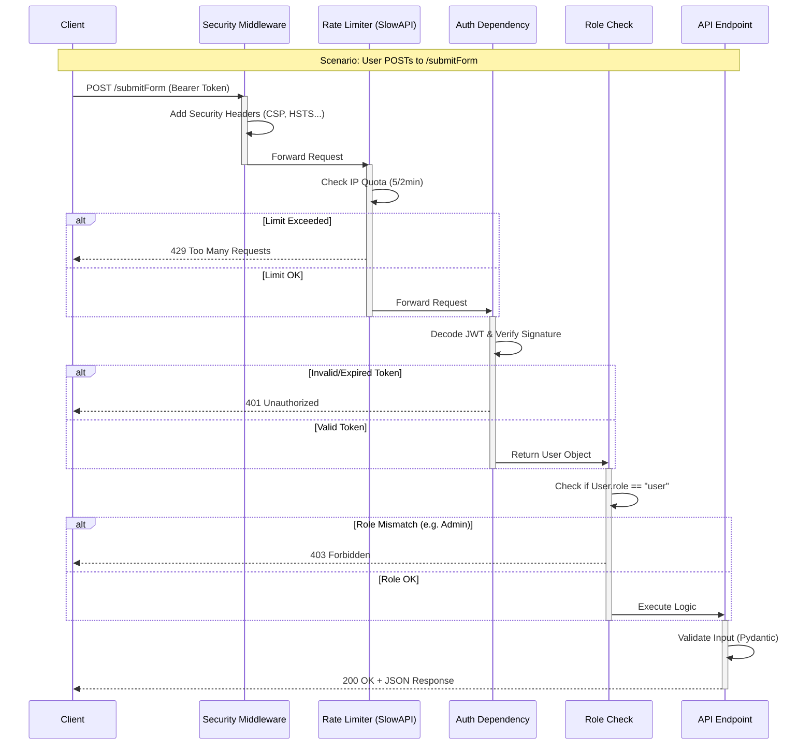

# Client-Server Request Flow

This document details the lifecycle of a request in the **SecureAuth Gateway**, illustrating how Security Middleware, Rate Limiting, Authentication, and RBAC interact to protect resources.

## Request Lifecycle Diagram

## Detailed Flow Breakdown

### 1. The Request
The client sends a `POST` request to `http://gateway/submitForm`.
*   **Headers**: Includes `Authorization: Bearer <JWT_TOKEN>`.
*   **Body**: JSON data matching `FormDetails` schema.

### 2. Security Middleware (Layer 1)
Before anything else, the custom middleware in `main.py` intercepts the request processing.
*   **Action**: It prepares the response object to include banking-grade security headers (`Strict-Transport-Security`, `Content-Security-Policy`, etc.) so they are present even if the request fails later.

### 3. Rate Limiter (Layer 2)
The `SlowAPI` limiter, configured in `limiter.py` and attached via decorators (`@limiter.limit`), inspects the client's **IP Address**.
*   **Check**: "Has this IP made more than 5 requests in the last 2 minutes?"
*   **Outcome**:
    *   **Fail**: Immediate `429 Too Many Requests` response. Processing stops.
    *   **Pass**: Request proceeds to the route handler.

### 4. Authentication (Layer 3)
The `formAccess` dependency creates a chain reaction. First, it calls `getCurrentUser`.
*   **Check**: The `OAuth2PasswordBearer` extracts the token. `jwt.decode` verifies the signature using `SECRET_KEY` and checks the `exp` (expiration) claim.
*   **Outcome**:
    *   **Fail**: `401 Unauthorized` (if token is missing, tampered, or expired).
    *   **Pass**: The `User` object (username, role) is retrieved from memory/DB.

### 5. Role-Based Access Control (Layer 4)
Now that the identity is known, `formAccess` checks **Authorization**.
*   **Check**: "Does `User.role` equal `'user'`?"
*   **Outcome**:
    *   **Fail**: `401 Unauthorized` (or 403) with message "Only User Can Submit Forms".
    *   **Pass**: The dependency returns the `User` object to the endpoint.

### 6. Endpoint Execution (Layer 5)
Finally, the `submitForm` function executes.
*   **Input Validation**: Pydantic validates the JSON body against `FormDetails`. If invalid, `422 Unprocessable Entity` is returned.
*   **Logic**: The business logic runs (e.g., saving data).
*   **Response**: The server returns `200 OK` with the result.

---

## Simplified Admin Flow (`responsesSaved.py`)

The flow for **Admins** accessing stored responses (`GET /responses`) is almost identical, but with a stricter "ID Check".

1.  **Security Checks**:
    *   **Middleware**: Adds security headers.
    *   **Rate Limiter**: Checks if the Admin IP is spamming (limit: 5/2min).

2.  **Authentication**:
    *   System verifies the JWT is valid and not expired.

3.  **The Critical Difference (RBAC)**:
    *   The `responsesAccess` dependency looks at the User's Role.
    *   **Question**: "Is `User.role` equal to `'admin'`?"
    *   **YES**: Access Granted -> Returns sensitive data.
    *   **NO**: Access Denied -> `401 Unauthorized`.

**In short**: Both flows protect the door, but the Admin flow has a "VIP only" sign inside.
